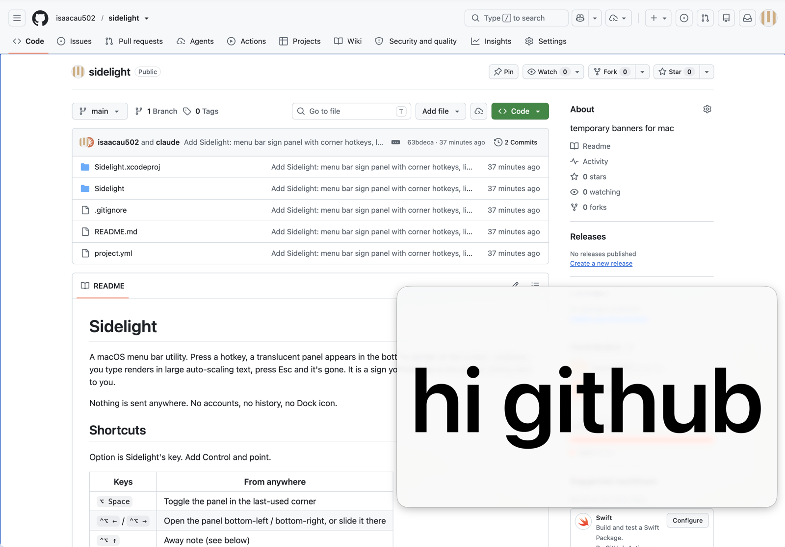
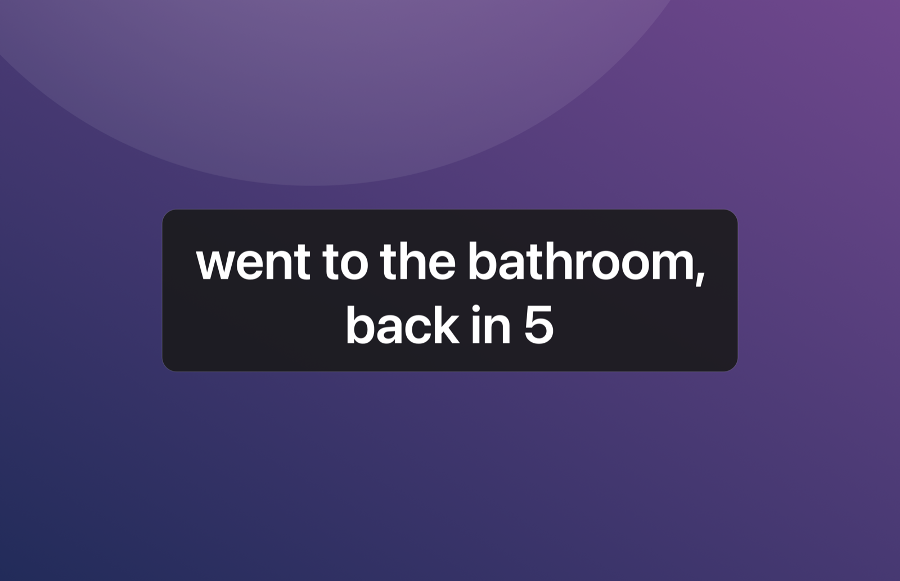

# Sidelight

Chatting with your seat neighbors but want to be more discreet than whispering?

A macOS menu bar utility. Press a hotkey, a translucent panel appears in the top corner of the screen, whatever you type renders in large auto-scaling text, press Esc and it's gone. It is a sign you hold up to the person sitting next to you.

Nothing is sent anywhere. No accounts, no history, no Dock icon.

## Demo

`⌥ Space`, type, done. Light appearance over a browser window:



`⌃⌥ ↑`, type a note, Return. The note is painted onto the wallpaper and the screen locks, so it shows on the lock screen until you come back. Rendered here over a plain gradient; on your Mac it's your own wallpaper.



## Shortcuts

Option is Sidelight's key. Add Control and point.

| Keys | From anywhere |
|---|---|
| `⌥ Space` | Toggle the panel in the last-used corner |
| `⌃⌥ ←` / `⌃⌥ →` | Open the panel top-left / top-right, or slide it there |
| `⌃⌥ ↑` | Away note (see below) |

| Keys | Inside the panel |
|---|---|
| `Esc` or `⌥ Space` | Clear and close |
| `Return` | New line |
| `⌘ Delete` | Clear, stay open |
| `⌘ Q` | Quit |

All four shortcuts can be re-recorded from the menu bar item under **Hotkeys…**.

## Away note

`⌃⌥ ↑` opens the panel in away mode. Type a note like "back in 5", press Return, and Sidelight paints it onto a copy of your wallpaper, sets that as the wallpaper, and locks the screen. The note shows on the lock screen. When you unlock, the original wallpaper comes back.

Two things to know:

- macOS wallpapers are per Space. The swap and restore happen on the Space you're on. If you lock on one desktop and unlock on another, go back to the first one and it restores itself the next time you use the away note there.
- Sidelight reads the wallpaper file, so it has to exist and live in Pictures or Downloads. If it can't be read, the note is painted on a flat dark background.

## Menu bar

- Show Sidelight, Away Note…
- Corner: Top right / Top left
- Appearance: Dark / Light
- Hotkeys…
- Launch at login
- Quit

## Building

Requires Xcode 16 or later and [xcodegen](https://github.com/yonaskolb/XcodeGen). The project file is generated from `project.yml`.

```
xcodegen generate
xcodebuild -project Sidelight.xcodeproj -scheme Sidelight -configuration Release build
```

Or open `Sidelight.xcodeproj` in Xcode and run. Change `DEVELOPMENT_TEAM` in `project.yml` to your own team before building.

The only dependency is [KeyboardShortcuts](https://github.com/sindresorhus/KeyboardShortcuts), resolved by Swift Package Manager.

## Settings

Everything lives in `UserDefaults` under `com.isaac.Sidelight`: the corner, the appearance, the four hotkeys, and the away note's wallpaper bookkeeping. Nothing else is written to disk.

## Requirements

macOS 14 or later. Uses the glass material on macOS 26 and a HUD vibrancy fallback before that.
